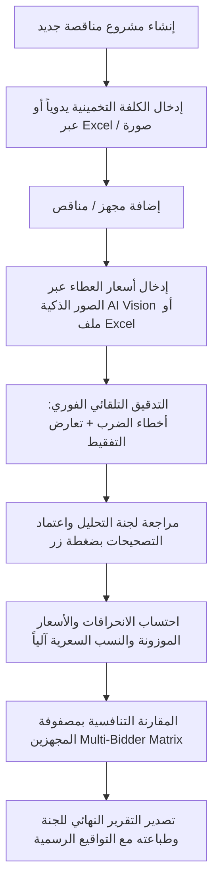

# 📑 وثيقة التسليم الشاملة والدليل المرجعي لنظام تحليل العطاءات والمناقصات الحكومية
### Comprehensive System Handoff & Technical Reference Manual

---

## 1. 🏛️ نظرة عامة ورسالة النظام (Executive Overview)

**نظام تحليل العطاءات والمناقصات الحكومية** هو منصة رقمية مهنية فائقة التطور، صُممت خصيصاً لأتمتة أعمال **لجان فتح وتحليل العطاءات** في المؤسسات والوزارات والشركات الحكومية والقطاع الخاص.

يقوم النظام باستبدال العمليات اليدوية الشاقة والمعرضة للخطأ البشري بمنظومة برمجية متكاملة تضمن:
1. **السرعة والامتثال القانوني الكامل**: مطابقة الإجراءات بدقة مع **تعليمات تنفيذ العقود الحكومية لسنة 2025** والضوابط والتعاميم الملحقة بها.
2. **التدقيق الحسابي والجنائي الدقيق**: رصد أي تلاعب أو أخطاء حسابية في الأسعار أو تعارض بين الأرقام والتفقيط اللغوي.
3. **الاستقلالية وسهولة التشغيل**: يعمل النظام كملف مستقل بالكامل (`نظام_تحليل_العطاءات.html`) دون الحاجة إلى إنترنت، خوادم، قواعد بيانات خارجية، أو برامج مساعدة.

---

## 2. ⚖️ المرجعية القانونية والمعايير الرياضية (Legal & Math Engine)

### أ. القواعد القانونية المنظمة لتدقيق الأسعار:
* **الاستبعاد عند تجاوز الكلفة التخمينية — المادة (13) / ثالثاً / أ من تعليمات تنفيذ العقود الحكومية لسنة 2025**:
  * النص الرسمي: *"على لجنة العطاءات استبعاد العطاء الذي يزيد أو يقل عن (20%) عشرين من المائة من الكلفة التخمينية المخصصة لغرض الإحالة."*
  * القاعدة متماثلة الاتجاه: تشمل تجاوز الكلفة التخمينية **والانخفاض** المبالغ فيه عنها بنفس النسبة (20%) على حد سواء.
* **استثناء التوصية بالتفاوض — المادة (13) / ثالثاً / ب**:
  * إذا كان **أقل عطاء مطابق للمواصفات** يتجاوز الحد المسموح (20%)، فبدل الاستبعاد المباشر يجوز التوصية بالإحالة للتفاوض لتخفيض السعر ضمن الحدود المسموحة دون المساس بنطاق العمل المعلن.
  * **حدود اختصاص لجنة التحليل هنا**: التفاوض الفعلي من اختصاص لجنة المراجعة / اللجنة المركزية، وليس لجنة التحليل. دور لجنة التحليل يقتصر على **رصد هذه الحالة والتوصية بإحالتها** في المحضر، لا إجراء التفاوض بنفسها.
* **مبدأ عدم التصحيح التلقائي الصامت في تدقيق الأسعار (No Silent Auto-Correction)**:
  * ضابط رقابي داخلي يعتمده النظام: عند وجود تعارض بين المبلغ المدون رقماً والمبلغ المكتوب كتابةً (التفقيط)، أو خطأ في حاصل ضرب سعر المفرد بالكمية، لا يُصحَّح الرقم تلقائياً وبصمت.
  * النظام **يحافظ دوماً على الأرقام الأصلية المدونة من قبل مقدم العطاء** كما هي دون تغيير قسري، لتوثيق العطاء كما قُدّم.
  * يمنح النظام لجنة التحليل **أزرار اعتماد صريحة وتفاعلية بنقرة واحدة**:
    * `[ اعتماد حاصل الضرب ]`
    * `[ اعتماد المكتوب كتابةً (التفقيط) ]`
    * مع توثيق الإجراء واسم العضو في سجل التدقيق.
  * **السند القانوني** (مُتحقق منه مقابل النص الرسمي للتعليمات رقم (1) لسنة 2025):
    * **المادة (10)/أولاً/ن** (ص 19): تدوين الأسعار رقماً وكتابة، و«يعول على السعر المدون كتابة في حالة اختلافه مع السعر المدون رقماً، كما يعول على سعر الوحدة في حالة عدم صحة مبلغ الفقرة».
    * **ضوابط رقم (4) خامساً/ب** (ص 67) — تصحيح الأخطاء الحسابية من قبل لجنة التحليل:
      * **/1**: عند الاختلاف بين الأسعار المكتوبة بالكلمات والأرقام تُعتمد المكتوبة بالكلمات.
      * **/2**: عند الاختلاف بين سعر الوحدة ومبلغ الفقرة يُعتمد سعر الوحدة (أي حاصل الضرب)، ما لم يكن هناك خطأ فادح في العلامة العشرية لسعر الوحدة فيُعتمد المبلغ كما هو مذكور.
      * **/3**: تُبلغ لجنة التحليل مقدم العطاء بالتصحيح الحسابي ليحضر ويوقع ويختم إزاءه.
      * **/5**: إذا رفض مقدم العطاء التصحيح يُستبعد عطاؤه وتُصادر تأميناته الأولية.
      * **/6**: يجري التصحيح والتدقيق الحسابي لجداول كميات جميع العطاءات لتحديد تسلسلها بعد التصحيح.
    * (الاستشهاد القديم بـ«المادة 13/ثانياً» كان خطأً: نصها يخص استعانة اللجنة بالخبرة.)

### ب. المعادلات الرياضية ونسب الانحراف المعيارية:
| المؤشر | المعادلة الرياضية | الوصف والغرض الرقابي |
|:---|:---|:---|
| **مبلغ المجهز** | $\text{Bidder Total} = \text{Quantity} \times \text{Bidder Unit Price}$ | القيمة الإجمالية للفقرة عند المجهز |
| **فرق المبلغ** | $\text{Diff} = \text{Bidder Total} - \text{Estimated Total}$ | الفرق المالي بين العطاء والكلفة التخمينية |
| **نسبة الانحراف** | $\text{Dev \%} = \frac{\text{Diff}}{\text{Estimated Total}} \times 100$ | نسبة ابتعاد سعر الفقرة عن الكلفة التخمينية |
| **الفقرة المنحرفة** | $\text{If } |\text{Dev \%}| > \text{Threshold } (20\%) \rightarrow |\text{Diff}|$ | رصد الفقرات التي تجاوزت حد الانحراف المسموح |
| **النسبة السعرية الكلية** | $\text{Price Ratio} = \frac{\sum \text{Bidder Totals}}{\sum \text{Estimated Totals}}$ | النسبة الإجمالية لعطاء المجهز إلى الكلفة التخمينية |
| **السعر الجديد الموزون** | $\text{New Price} = \text{Price Ratio} \times \text{Estimated Total}$ | السعر الموزون المعتمد للفقرة عند التعديل |
| **سعر المفرد الموزون** | $\text{Weighted Unit Price} = \frac{\text{New Price}}{\text{Quantity}}$ | سعر المفرد الجديد بعد التوزيع النسبي |
| **نسبة الانحراف الكلي** | $\text{Total Dev \%} = \frac{\sum \text{Bidder} - \sum \text{Estimated}}{\sum \text{Estimated}} \times 100$ | نسبة انحراف مجمل العطاء عن الكلفة التخمينية |
| **نسبة الانحراف الجزئي** | $\text{Partial Dev \%} = \frac{\sum \text{Deviated Items Amounts}}{\sum \text{Bidder Total}} \times 100$ | نسبة مبالغ الفقرات المنحرفة إلى إجمالي العطاء |

### ج. صياغة التوصية وحالاتها (`src/utils/recommendation.ts`):
محرك واحد تستخدمه خلاصة الترسية والمحضر المطبوع، يُحسب من كل العطاءات لا من التبويب المفتوح:
* **إحالة (award)**: على العطاء الذي اختارته اللجنة بزر «اختيار للترسية»، وإلا على أوطأ العطاءات المؤهلة تجارياً. إن اختارت اللجنة عطاءً غير الأوطأ تُضاف ملاحظة **المادة (10)/أولاً/هـ** (جهة التعاقد غير ملزمة بقبول أوطأ العطاءات) مع وجوب تثبيت المسوغات.
* **تقارب/تساوٍ (tie)**: إذا تساوت عطاءات مؤهلة أو تقاربت لغاية **(1%) من الكلفة التخمينية** — **ضوابط رقم (5) معايير المفاضلة** (ثانياً/2 للأشغال، ثالثاً/2 للتجهيز، رابعاً/2 للخدمات غير الاستشارية): التوصية بالمفاضلة بتحويل المعايير لقيمة مالية (مدة العقد، الصيانة، الضمان، خدمات ما بعد البيع، المبادرات). وعند التساوي التام: استكمال المبادرات (ضوابط 5)، ثم جواز الإرساء على أكثر من متقدم إن نصت عليه شروط المناقصة (**المادة 15/رابعاً/أ**).
* **إحالة للتفاوض (referral)**: لا عطاء ضمن الحدود و**أقل العطاءات نفسه** يزيد عليها — **المادة (13)/ثالثاً/ب**، ثم **المادة (20)/أولاً** إن فشلت المفاوضات.
* **إعادة إعلان (retender)**: لا عطاء ضمن الحدود وأقل العطاءات يقل عنها (حتى لو زادت عطاءات أخرى، فاستثناء 13/ثالثاً/ب مشروط بزيادة الأقل) — **المادة (20)/رابعاً**؛ أو استبعدتها اللجنة كلها — **المادة (20)/ثالثاً**.
* **بلا كلفة تخمينية (no-estimate)**: لا تُصاغ توصية، لأن الانحرافات لا تُحتسب.
* العطاء الذي حالته «مستبعد» (`disqualified`) بقرار اللجنة لا يدخل في التوصية.
* **نوع العقد** (`src/utils/contractTypes.ts`) يُختار إلزامياً عند إنشاء المناقصة، ويُعدَّل من الإعدادات: أشغال (مقاولات عامة) / تجهيز / خدمات غير استشارية. يحدد فقرة معايير المفاضلة وأمثلتها في التوصية: ضوابط (5) ثانياً/2 للأشغال، ثالثاً/2 للتجهيز، رابعاً/2 للخدمات غير الاستشارية. أما قاعدة ±20% والإحالة للتفاوض وإعادة الإعلان فعامة لكل الأنواع. الخدمات الاستشارية غير مشمولة عمداً، لأن عروضها التجارية تُفتح بعد التقييم الفني (ضوابط 4 ثانياً/3) ولا تُطرح بمناقصة عامة (المادة 6). المناقصات القديمة بلا نوع تُصاغ توصيتها بصيغة عامة، مع تنبيه «حدد نوع العقد».
* الأسعار الموزونة تُعتمد عند إصدار **أوامر التغيير** وفق **المادة (25)/ثالثاً** (زيادة أو نقصان لا يتجاوز 30%). عبارة «أوامر الغيار» السابقة لا ترد في التعليمات.

---

## 3. 🧠 محركات التدقيق والذكاء الاصطناعي (Core Engines)

### 1. محرك الذكاء الاصطناعي الرؤيوي لقراءة المستندات (AI Vision OCR Engine)
* **المسار**: `src/utils/ocrService.ts`
* **الميزات**:
  * الاتصال المباشر بنماذج **Google Gemini Vision** (`gemini-2.0-flash`, `gemini-1.5-flash`).
  * فك طلاسم الجداول المكتوبة **بخط اليد** والممسوحة بكاميرات الهواتف بدقة فائقة.
  * تفكيك تلقائي للأعمدة (ت، اسم المادة، الوحدة، الكمية، سعر المفرد، الإجمالي، التفقيط المكتوب).
  * **دعم رفع صور متعددة (Multi-Page)** لنفس العطاء ومعالجتها بالتسلسل ودمجها في جدول موحد.
  * أداة تدوير الصور **90 درجة** لتصحيح زوايا التصوير.
  * أداة فحص واختبار مفتاح API مباشرة من واجهة المستخدم.
  * محرك بديل محلي دون إنترنت (Offline Local OCR عبر Tesseract.js).

### 2. محرك التدقيق اللغوي والتفقيط الحسابي العربي (Arabic Tafqeet Parser)
* **المسار**: `src/utils/bidderAuditEngine.ts`
* **الميزات**:
  * خوارزمية ذكية مبنية على تحليل الرموز اللغوية العربية (Token-Based Parsing).
  * تحويل الكلمات العربية المعقدة إلى قيم رقمية بدقة 100% (مثل: "مليونان وثلاثمائة وسبعة وسبعون ألف وخمسمائة وخمسون دينار").
  * **نظام التمييز البصري ثلاثي الألوان**:
    * 🟢 **أخضر (مطابق)**: التفقيط يتطابق تماماً مع المبلغ المدون.
    * 🟠 **برتقالي (تعارض تفقيط)**: يوجد تعارض بين المبلغ رقماً والمكتوب كتابةً.
    * 🔴 **أحمر (خطأ حسابي)**: حاصل ضرب (الكمية × سعر المفرد) لا يساوي المبلغ المدون.

### 3. محرك الاستيراد والتصدير الذكي من Excel
* **المسار**: `src/utils/excelService.ts`
* **الميزات**:
  * استيراد جداول الكميات والكلف التخمينية وجداول المجهزين بصيغة `.xlsx` و `.xls` و `.csv`.
  * التعرف الذكي التلقائي على رؤوس الأعمدة المختلفة والتوفيق بينها.
  * تصدير نتائج التحليل، الجداول التفصيلية، ومصفوفة المقارنة بملفات Excel احترافية ومنسقة.

---

## 4. 💻 البنية البرمجية والهيكلية الفنية (Architecture & Stack)

```
نظام تحليل العطاءات/
├── src/
│   ├── assets/                 # الأيقونات (SVG)
│   ├── components/
│   │   ├── BOQTable.tsx            # جدول الكميات والأسعار والتدقيق الجنائي والتفاعلي
│   │   ├── KPIStatsCards.tsx       # بطاقات المؤشرات المالية والإحصائية
│   │   ├── ChartsView.tsx          # الرسوم البيانية التفاعلية (الانحرافات، مبالغ المجهزين)
│   │   ├── ExecutiveSummaryView.tsx# التقرير الختامي وتوصيات لجنة التحليل
│   │   ├── Navbar.tsx              # شريط التنقل العلوي وتبديل المجهزين
│   │   └── modals/
│   │       ├── ImageOcrModal.tsx       # نافذة الاستخراج من الصور وخط اليد بالذكاء الاصطناعي
│   │       ├── SmartTableImportModal.ts# نافذة الاستيراد الذكي ومطابقة أعمدة Excel
│   │       ├── MultiBidderMatrix.tsx   # مصفوفة المقارنة المتقاطعة بين كافة المجهزين
│   │       ├── PrintReportModal.tsx    # نافذة التقرير القابل للطباعة والتصدير
│   │       ├── ProjectSettingsModal.tsx# إعدادات المناقصة والجهة والعملة وحدود الانحراف
│   │       └── AuditTrailModal.tsx     # سجل التدقيق وتتبع العمليات غير القابل للتعديل
│   ├── types/
│   │   └── tender.ts           # نماذج البيانات والواجهات البرمجية (TypeScript Interfaces)
│   ├── utils/
│   │   ├── calculations.ts     # المحرك الرياضي وحساب الانحرافات والأسعار الموزونة
│   │   ├── bidderAuditEngine.ts# محرك التدقيق الجنائي وتفكيك التفقيط اللغوي العربي
│   │   ├── ocrService.ts       # محرك الذكاء الاصطناعي Gemini Vision والرؤية الحاسوبية
│   │   ├── excelService.ts     # خدمات معالجة وتوليد ملفات Excel
│   │   └── storageService.ts   # التخزين المحلي الآمن وإدارة المشاريع (LocalStorage)
│   ├── App.tsx                 # نقطة الدخول الرئيسية وإدارة الحالة المشتركة
│   └── main.tsx                # نقطة تشغيل التطبيق
├── نظام_تحليل_العطاءات.html    # التطبيق الكامل كملف مستقل أحادي (Standalone Single File)
├── تشغيل_النظام.bat           # ملف تشغيل فوري بنقرة واحدة
├── package.json                # التبعيات وحزم النظام
└── vite.config.ts              # إعدادات البناء والتضمين الأحادي (Vite SingleFile Plugin)
```

---

## 5. 🚀 دليل التشغيل السريع (Quick Start Guide)

### للمستخدم النهائي:
1. انقر نقراً مزدوجاً على الملف: **`نظام_تحليل_العطاءات.html`** (أو `تشغيل_النظام.bat`).
2. يفتح النظام فوراً في متصفحك المفضل (Chrome, Edge, Firefox) دون الحاجة لأي خادم أو اتصال إنترنت. ملف `تشغيل_النظام.bat` يفتحه بنافذة تطبيق مستقلة بلا شريط المتصفح.

### التثبيت كتطبيق ويندوز (PWA):
1. افتح **https://usama-kh75.github.io/tender-analysis-system/** في Edge أو Chrome.
2. اضغط أيقونة «تثبيت التطبيق» في شريط العنوان، فيظهر النظام في قائمة ابدأ وشريط المهام.
3. يعمل بلا إنترنت بعد أول فتح، بما في ذلك محرك OCR الموضعي بعد أول استعمال له. الاستخراج الذكي (Gemini) وحده يحتاج إنترنت.

بيانات التطبيق المثبَّت منفصلة عن بيانات الملف المحمول (كلٌّ في تخزين مستقل للمتصفح)؛ النقل بينهما عبر تصدير/استيراد النسخة الاحتياطية JSON.

**نشر إصدار جديد للتطبيق:** يُرفع رقم الإصدار في `package.json`، ويُضاف ملخص ما تغيّر بلغة المستخدم في أول `CHANGELOG` داخل `src/changelog.ts` (يظهر في نافذة «ما الجديد» مرة واحدة بعد التحديث، ويُفتح بالضغط على رقم الإصدار أسفل الصفحة)، ثم `git tag vX.Y.Z` و`git push origin vX.Y.Z` — النشر (`.github/workflows/pages.yml`) لا يعمل إلا عند وسم إصدار، والتطبيقات المثبتة تستلم التحديث عند فتحها التالي مع اتصال.

### للمطور (Development & Build):
```bash
# تثبيت الحزم
npm install

# تشغيل بيئة التطوير المحلية
npm run dev

# بناء النسخة المستقلة النهائية (Single File Bundle)
npm run build
Copy-Item -Path "dist\index.html" -Destination "نظام_تحليل_العطاءات.html" -Force
```

---

## 6. 📊 سير العمل النموذجي للتحليل المالي (Standard Workflow)



---

## 7. 🔒 الأمان، السرية، وتخزين البيانات

* **الخصوصية التامة**: جميع بيانات المشاريع والأسعار والمناقصين تُحفظ محلياً في ذاكرة المتصفح (`LocalStorage`) ولا تُرسل لأي خادم خارجي — حتى في نسخة التطبيق المنشورة على الويب، التي تنشر الشيفرة وحدها. مسح بيانات المتصفح يحذف المشاريع، فالنسخ الاحتياطي الدوري (JSON) ضروري.
* **مفتاح API للذكاء الاصطناعي**: يُحفظ في المتصفح الشخصي للمستخدم فقط ويُستخدم مباشرة للاتصال المشفر مع واجهة Google الرسمية.
* **سجل التدقيق الجنائي (Audit Trail)**: كل عملية إدخال، تعديل، حذف، أو اعتماد تصحيح تُسجل مع الطابع الزمني واسم المستخدم لمنع أي تلاعب.

---

## 8. 🌟 خطة التطوير المستقبلي المقترحة (Roadmap)

1. **الربط مع قواعد البيانات السحابية (اختياري)**: دعم التخزين السحابي المشترك بين أعضاء اللجنة.
2. **التوقيع الرقمي الإلكتروني**: توقيع أعضاء اللجنة إلكترونياً على التقرير الختامي.
3. **تحليل العطاءات الفنية**: إضافة منظومة تقييم درجات المعايير الفنية ودمجها مع التقييم المالي.
4. **تصدير مستندات Word رسمية**: توليد محاضر الفتح والتحليل كملفات Word جاهزة للطباعة.

---
**تاريخ إصدار الوثيقة:** 25 آب / أغسطس 2026  
**الإصدار:** Version 2.4 (Enterprise Edition)
