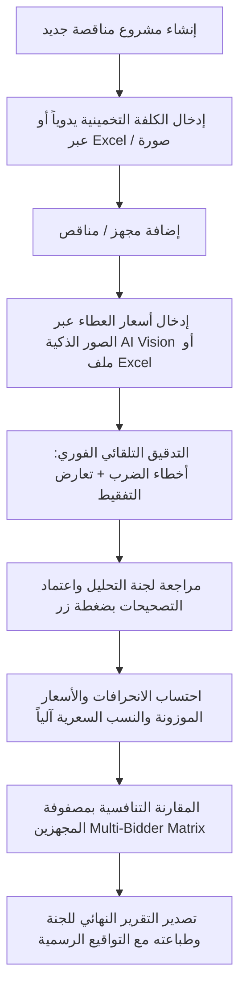

# 📑 وثيقة التسليم الشاملة والدليل المرجعي لنظام تحليل العطاءات والمناقصات الحكومية
### Comprehensive System Handoff & Technical Reference Manual

---

## 1. 🏛️ نظرة عامة ورسالة النظام (Executive Overview)

**نظام تحليل العطاءات والمناقصات الحكومية** هو منصة رقمية مهنية فائقة التطور، صُممت خصيصاً لأتمتة أعمال **لجان فتح وتحليل العطاءات** في المؤسسات والوزارات والشركات الحكومية والقطاع الخاص.

يقوم النظام باستبدال العمليات اليدوية الشاقة والمعرضة للخطأ البشري بمنظومة برمجية متكاملة تضمن:
1. **السرعة والامتثال القانوني الكامل**: مطابقة الإجراءات بدقة مع **تعليمات تنفيذ العقود الحكومية رقم (2) لسنة 2014** والضوابط الصادرة بموجبها.
2. **التدقيق الحسابي والجنائي الدقيق**: رصد أي تلاعب أو أخطاء حسابية في الأسعار أو تعارض بين الأرقام والتفقيط اللغوي.
3. **الاستقلالية وسهولة التشغيل**: يعمل النظام كملف مستقل بالكامل (`نظام_تحليل_العطاءات.html`) دون الحاجة إلى إنترنت، خوادم، قواعد بيانات خارجية، أو برامج مساعدة.

---

## 2. ⚖️ المرجعية القانونية والمعايير الرياضية (Legal & Math Engine)

### أ. القواعد القانونية المنظمة لتدقيق الأسعار:
* **المادة (13 / ثانياً) من تعليمات تنفيذ العقود الحكومية**:
  * النص المكتوب (التفقيط) يعتمد عند وجود اختلاف بينه وبين المبلغ المدون رقماً ما لم يثبت وجود خطأ مادي واضح.
  * سعر المفرد المكتوب كتابةً أو رقماً هو الأساس، ويصحح الإجمالي بناءً على حاصل ضرب سعر المفرد في الكمية.
* **مبدأ عدم التصحيح التلقائي الصامت (No Silent Auto-Correction)**:
  * النظام **يحافظ دوماً على الأرقام الأصلية المدونة من قبل مقدم العطاء** كما هي دون تغيير قسري، لتوثيق العطاء كما قُدّم قانونياً.
  * يمنح النظام لجنة التحليل **أزرار اعتماد صريحة وتفاعلية بنقرة واحدة**:
    * `[ اعتماد حاصل الضرب ]`
    * `[ اعتماد المكتوب كتابةً (التفقيط) ]`
    * مع توثيق الإجراء والسند القانوني واسم العضو في سجل التدقيق.

### ب. المعادلات الرياضية ونسب الانحراف المعيارية:
| المؤشر | المعادلة الرياضية | الوصف والغرض الرقابي |
|:---|:---|:---|
| **مبلغ المجهز** | $\text{Bidder Total} = \text{Quantity} \times \text{Bidder Unit Price}$ | القيمة الإجمالية للفقرة عند المجهز |
| **فرق المبلغ** | $\text{Diff} = \text{Bidder Total} - \text{Estimated Total}$ | الفرق المالي بين العطاء والكلفة التخمينية |
| **نسبة الانحراف** | $\text{Dev \%} = \frac{\text{Diff}}{\text{Estimated Total}} \times 100$ | نسبة ابتعاد سعر الفقرة عن الكلفة التخمينية |
| **الفقرة المنحرفة** | $\text{If } |\text{Dev \%}| > \text{Threshold } (20\%) \rightarrow |\text{Diff}|$ | رصد الفقرات التي تجاوزت حد الانحراف المسموح |
| **النسبة السعرية الكلية** | $\text{Price Ratio} = \frac{\sum \text{Bidder Totals}}{\sum \text{Estimated Totals}}$ | النسبة الإجمالية لعطاء المجهز إلى الكلفة التخمينية |
| **السعر الجديد الموزون** | $\text{New Price} = \text{Price Ratio} \times \text{Estimated Total}$ | السعر الموزون المعتمد للفقرة عند التعديل |
| **سعر المفرد الموزون** | $\text{Weighted Unit Price} = \frac{\text{New Price}}{\text{Quantity}}$ | سعر المفرد الجديد بعد التوزيع النسبي |
| **نسبة الانحراف الكلي** | $\text{Total Dev \%} = \frac{\sum \text{Bidder} - \sum \text{Estimated}}{\sum \text{Estimated}} \times 100$ | نسبة انحراف مجمل العطاء عن الكلفة التخمينية |
| **نسبة الانحراف الجزئي** | $\text{Partial Dev \%} = \frac{\sum \text{Deviated Items Amounts}}{\sum \text{Bidder Total}} \times 100$ | نسبة مبالغ الفقرات المنحرفة إلى إجمالي العطاء |

---

## 3. 🧠 محركات التدقيق والذكاء الاصطناعي (Core Engines)

### 1. محرك الذكاء الاصطناعي الرؤيوي لقراءة المستندات (AI Vision OCR Engine)
* **المسار**: `src/utils/ocrService.ts`
* **الميزات**:
  * الاتصال المباشر بنماذج **Google Gemini Vision** (`gemini-2.0-flash`, `gemini-1.5-flash`).
  * فك طلاسم الجداول المكتوبة **بخط اليد** والممسوحة بكاميرات الهواتف بدقة فائقة.
  * تفكيك تلقائي للأعمدة (ت، اسم المادة، الوحدة، الكمية، سعر المفرد، الإجمالي، التفقيط المكتوب).
  * **دعم رفع صور متعددة (Multi-Page)** لنفس العطاء ومعالجتها بالتسلسل ودمجها في جدول موحد.
  * أداة تدوير الصور **90 درجة** لتصحيح زوايا التصوير.
  * أداة فحص واختبار مفتاح API مباشرة من واجهة المستخدم.
  * محرك بديل محلي دون إنترنت (Offline Local OCR عبر Tesseract.js).

### 2. محرك التدقيق اللغوي والتفقيط الحسابي العربي (Arabic Tafqeet Parser)
* **المسار**: `src/utils/bidderAuditEngine.ts`
* **الميزات**:
  * خوارزمية ذكية مبنية على تحليل الرموز اللغوية العربية (Token-Based Parsing).
  * تحويل الكلمات العربية المعقدة إلى قيم رقمية بدقة 100% (مثل: "مليونان وثلاثمائة وسبعة وسبعون ألف وخمسمائة وخمسون دينار").
  * **نظام التمييز البصري ثلاثي الألوان**:
    * 🟢 **أخضر (مطابق)**: التفقيط يتطابق تماماً مع المبلغ المدون.
    * 🟠 **برتقالي (تعارض تفقيط)**: يوجد تعارض بين المبلغ رقماً والمكتوب كتابةً.
    * 🔴 **أحمر (خطأ حسابي)**: حاصل ضرب (الكمية × سعر المفرد) لا يساوي المبلغ المدون.

### 3. محرك الاستيراد والتصدير الذكي من Excel
* **المسار**: `src/utils/excelService.ts`
* **الميزات**:
  * استيراد جداول الكميات والكلف التخمينية وجداول المجهزين بصيغة `.xlsx` و `.xls` و `.csv`.
  * التعرف الذكي التلقائي على رؤوس الأعمدة المختلفة والتوفيق بينها.
  * تصدير نتائج التحليل، الجداول التفصيلية، ومصفوفة المقارنة بملفات Excel احترافية ومنسقة.

---

## 4. 💻 البنية البرمجية والهيكلية الفنية (Architecture & Stack)

```
نظام تحليل العطاءات/
├── src/
│   ├── assets/                 # الشعارات والأيقونات (شعار شركة نفط البصرة، SVG)
│   ├── components/
│   │   ├── BOQTable.tsx            # جدول الكميات والأسعار والتدقيق الجنائي والتفاعلي
│   │   ├── KPIStatsCards.tsx       # بطاقات المؤشرات المالية والإحصائية
│   │   ├── ChartsView.tsx          # الرسوم البيانية التفاعلية (الانحرافات، مبالغ المجهزين)
│   │   ├── ExecutiveSummaryView.tsx# التقرير الختامي وتوصيات لجنة التحليل
│   │   ├── Navbar.tsx              # شريط التنقل العلوي وتبديل المجهزين
│   │   └── modals/
│   │       ├── ImageOcrModal.tsx       # نافذة الاستخراج من الصور وخط اليد بالذكاء الاصطناعي
│   │       ├── SmartTableImportModal.ts# نافذة الاستيراد الذكي ومطابقة أعمدة Excel
│   │       ├── MultiBidderMatrix.tsx   # مصفوفة المقارنة المتقاطعة بين كافة المجهزين
│   │       ├── PrintReportModal.tsx    # نافذة التقرير القابل للطباعة والتصدير
│   │       ├── ProjectSettingsModal.tsx# إعدادات المناقصة والجهة والعملة وحدود الانحراف
│   │       └── AuditTrailModal.tsx     # سجل التدقيق وتتبع العمليات غير القابل للتعديل
│   ├── types/
│   │   └── tender.ts           # نماذج البيانات والواجهات البرمجية (TypeScript Interfaces)
│   ├── utils/
│   │   ├── calculations.ts     # المحرك الرياضي وحساب الانحرافات والأسعار الموزونة
│   │   ├── bidderAuditEngine.ts# محرك التدقيق الجنائي وتفكيك التفقيط اللغوي العربي
│   │   ├── ocrService.ts       # محرك الذكاء الاصطناعي Gemini Vision والرؤية الحاسوبية
│   │   ├── excelService.ts     # خدمات معالجة وتوليد ملفات Excel
│   │   └── storageService.ts   # التخزين المحلي الآمن وإدارة المشاريع (LocalStorage)
│   ├── App.tsx                 # نقطة الدخول الرئيسية وإدارة الحالة المشتركة
│   └── main.tsx                # نقطة تشغيل التطبيق
├── نظام_تحليل_العطاءات.html    # التطبيق الكامل كملف مستقل أحادي (Standalone Single File)
├── تشغيل_النظام.bat           # ملف تشغيل فوري بنقرة واحدة
├── package.json                # التبعيات وحزم النظام
└── vite.config.ts              # إعدادات البناء والتضمين الأحادي (Vite SingleFile Plugin)
```

---

## 5. 🚀 دليل التشغيل السريع (Quick Start Guide)

### للمستخدم النهائي:
1. انقر نقراً مزدوجاً على الملف: **`نظام_تحليل_العطاءات.html`** (أو `تشغيل_النظام.bat`).
2. يفتح النظام فوراً في متصفحك المفضل (Chrome, Edge, Firefox) دون الحاجة لأي خادم أو اتصال إنترنت.

### للمطور (Development & Build):
```bash
# تثبيت الحزم
npm install

# تشغيل بيئة التطوير المحلية
npm run dev

# بناء النسخة المستقلة النهائية (Single File Bundle)
npm run build
Copy-Item -Path "dist\index.html" -Destination "نظام_تحليل_العطاءات.html" -Force
```

---

## 6. 📊 سير العمل النموذجي للتحليل المالي (Standard Workflow)



---

## 7. 🔒 الأمان، السرية، وتخزين البيانات

* **الخصوصية التامة**: جميع بيانات المشاريع والأسعار والمناقصين تُحفظ محلياً في ذاكرة المتصفح (`IndexedDB` / `LocalStorage`) ولا تُرسل لأي خادم خارجي.
* **مفتاح API للذكاء الاصطناعي**: يُحفظ في المتصفح الشخصي للمستخدم فقط ويُستخدم مباشرة للاتصال المشفر مع واجهة Google الرسمية.
* **سجل التدقيق الجنائي (Audit Trail)**: كل عملية إدخال، تعديل، حذف، أو اعتماد تصحيح تُسجل مع الطابع الزمني واسم المستخدم لمنع أي تلاعب.

---

## 8. 🌟 خطة التطوير المستقبلي المقترحة (Roadmap)

1. **الربط مع قواعد البيانات السحابية (اختياري)**: دعم التخزين السحابي المشترك بين أعضاء اللجنة.
2. **التوقيع الرقمي الإلكتروني**: توقيع أعضاء اللجنة إلكترونياً على التقرير الختامي.
3. **تحليل العطاءات الفنية**: إضافة منظومة تقييم درجات المعايير الفنية ودمجها مع التقييم المالي.
4. **تصدير مستندات Word رسمية**: توليد محاضر الفتح والتحليل كملفات Word جاهزة للطباعة.

---
**تاريخ إصدار الوثيقة:** 25 آب / أغسطس 2026  
**الإصدار:** Version 2.4 (Enterprise Edition)
