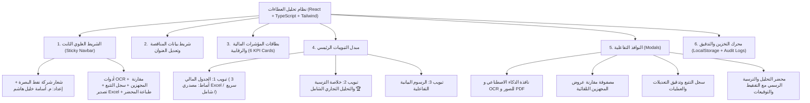

# دليل النظام والهيكل الفني والأسس القانونية
## نظام تحليل وتقييم العطاءات المتكامل (BOC Tender Analysis System)
### وزارة النفط • شركة نفط البصرة (BOC) • هيأة المشاريع والمشتريات
**إعداد وتطوير: المهندس أسامة خليل هاشم**

---

## 1. نبذة عامة عن النظام (Overview)

تم بناء وتصميم **"نظام تحليل وتقييم العطاءات المتكامل"** ليكون منصة متكاملة وذكية تعمل محلياً بنسبة 100% دون الحاجة إلى اتصال بالإنترنت (Offline-First Single-File Application). يهدف النظام إلى أتمتة وتحليل وتقييم العطاءات وجداول الكميات (BOQ) ومقارنة عروض المناقصين والمجهزين في المناقصات والطلبيات وفق أحدث ضوابط وتعليمات تنفيذ العقود الحكومية وتعليمات وزارة النفط وشركة نفط البصرة لعام 2025.

---

## 2. الأسس والمعايير الرقابية والقانونية المعتمدة (Legal & Regulatory Foundations)

تمت برمجة وتطوير كافة القواعد الرياضية والرقابية استناداً إلى:
1. **تعليمات تنفيذ العقود الحكومية (رقم 2 لسنة 2014) وتحديثاتها والضوابط الصادرة لعام 2025:**
   * **المادة (13 / ثالثاً / أ):** الاستبعاد الحتمي والتلقائي لأي عطاء يتجاوز انحرافه الإجمالي عن الكلفة التخمينية نسبة $\pm 20\%$ ما لم تتوفر استثناءات وموافقات عليا مسبقة.
   * **المادة (13 / ثانياً):** التدقيق والتصحيح الحسابي التلقائي؛ حيث يُعتد بسعر المفرد المدون في العطاء وتُصحح أخطاء الضرب والجمع آلياً.
   * **قاعدة التفقيط والتباين:** عند الاختلاف بين المبلغ المدون رقماً والمدون كتابةً، يُعتد بالمبلغ المدون كتابةً (بالحروف والألفاظ).
2. **معايير اتزان العطاء والتحميل المسبق (Unbalanced Bidding & Front-loading):**
   * كشف الفقرات المنحرفة جزئياً (التي يزيد انحرافها عن 20%).
   * احتساب نسبة الانحراف الجزئي $\frac{\text{مجموع مبالغ الفقرات المنحرفة}}{\text{إجمالي مبلغ العطاء}} \times 100$.
   * تطبيق **الأسعار والمفردات الموزونة (Weighted Unit Prices)** كشرط تعاقدي لحماية شركة نفط البصرة عند إصدار أوامر الغيار أثناء التنفيذ.

---

## 3. المعادلات الرياضية والحسابية المعتمدة (Mathematical Engine)

| المؤشر المالي | المعادلة الرياضية المعتمدة | الفائدة والغرض الرقابي |
| :--- | :--- | :--- |
| **فرق المبلغ للفقرة** | $\text{مبلغ المجهز} - \text{المبلغ التخميني}$ | كشف الزيادة أو التوفير في كل فقرة |
| **نسبة انحراف الفقرة %** | $\frac{\text{مبلغ المجهز} - \text{المبلغ التخميني}}{\text{المبلغ التخميني}} \times 100$ | تحديد ما إذا كانت الفقرة تخطت حد $\pm 20\%$ |
| **قيمة الانحراف للفقرة** | $\text{إذا كانت النسبة} > 20\% \implies \text{فرق المبلغ} \text{ ، وإلا } 0$ | حصر المبالغ المتضخمة غير المتزنة |
| **النسبة السعرية الإجمالية** | $\text{Overall Price Ratio} = \frac{\sum \text{مبالغ المجهز}}{\sum \text{المبالغ التخمينية}}$ | المعامل الوزني العام لكامل العطاء |
| **السعر الجديد الموزون** | $\text{المبلغ التخميني للفقرة} \times \text{النسبة السعرية الإجمالية}$ | السعر العادل المعدل وفق وزن العطاء |
| **المفرد المجهز الموزون** | $\frac{\text{السعر الجديد الموزون}}{\text{الكمية}}$ | السعر المفرد المعتمد في العقد لأوامر الغيار |
| **الانحراف الكلي للعطاء %** | $\frac{\sum \text{مبالغ المجهز} - \sum \text{المبالغ التخمينية}}{\sum \text{المبالغ التخمينية}} \times 100$ | فحص سقف الاستبعاد القانوني ($\pm 20\%$) |
| **الانحراف الجزئي %** | $\frac{\sum \text{مبالغ الفقرات المنحرفة}}{\sum \text{مبالغ المجهز}} \times 100$ | قياس درجة خطورة عدم اتزان العطاء |

---

## 4. الهيكل البرمجي والمعماري للنظام (Architecture & Hierarchy)

---

## 5. سجل القرارات التصميمية والفنية (Decision Log)

1. **العمل المستقل الأوفلاين 100%:**
   * تم تجميع المشروع في ملف HTML واحد مدمج (`نظام_تحليل_العطاءات.html`) بوزن خفيف وتضمين الشعار بصيغة Base64 ليعمل على أي جهاز في شركة نفط البصرة بدون إنترنت.
2. **مبدّل أنماط العرض الثلاثة:**
   * **النمط المصدري المعتمد (Excel) 📑:** مطابق 100% لمصفوفة أعمدة شيت `جدول نهائي.xlsx` مع قفل الحسابات للعرض وحصر الإدخال في التخميني والمجهز.
   * **النمط السريع ⚡:** إدخال مباشر ومبسط لمئات الفقرات بسرعة فائقة.
   * **النمط الشامل 📝:** عرض الأوصاف والتقييمات التفصيلية.
3. **أتمتة مصفوفة المقارنة والترسية:**
   * لا يتطلب جدول المقارنة أي إدخال يدوي؛ بل تتولد الترتيبات وحالات الاستبعاد التجاري والترسية تلقائياً من بيانات العطاءات.
4. **محرك التفقيط ومعالجة الأرقام:**
   * دعم كامل للأرقام المشرقية/الهندية (`٠-٩`) والتفقيط اللغوي القانوني للمبالغ بالحروف العربية في محاضر الترسية الرسمية.

---

## 6. دليل تشغيل وتطوير النظام (Operation & Developer Guide)

* **للتشغيل الفوري (المستخدم النهائي):**
  * النقر المزدوج على ملف: `E:\Antigravity projects\نظام تحليل العطاءات\تشغيل_النظام.bat`
  * أو فتح الملف مباشرة في المتصفح: `E:\Antigravity projects\نظام تحليل العطاءات\نظام_تحليل_العطاءات.html`
* **للتطوير والبناء (Developer Build):**
  * تشغيل وضع التطوير: `npm run dev`
  * بناء الحزمة الأحادية: `npm run build`
