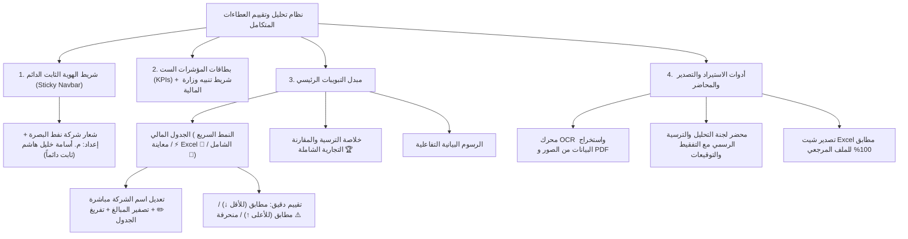

# محضر وخلاصة إنجاز نظام تحليل وتقييم العطاءات المتكامل
## وزارة النفط • شركة نفط البصرة (BOC) • هيأة المشاريع والمشتريات
**إعداد وتطوير: المهندس أسامة خليل هاشم**

---

### 📋 الملخص التنفيذي الشامل لما تم إنجازه:

تم بحمد الله وتوفيقه إنجاز وتطوير النظام المتكامل لتحليل وتقييم العطاءات والمناقصات والطلبيات لشركة نفط البصرة، وفق أحدث الأسس الهندسية والرقابية لـ **تعليمات تنفيذ العقود الحكومية لعام 2025**.

---

### 1. الركائز القانونية والرقابية المدمجة في النظام:
* **قاعدة الاستبعاد الإجمالي ($\pm 20\%$):** استبعاد العطاءات المتجاوزة أو المنخفضة عن الكلفة التخمينية بنفس النسبة (المادة 13/ثالثاً/أ).
* **استثناء التوصية بالتفاوض:** إذا كان أقل عطاء مطابق للمواصفات يتجاوز الحد المسموح، توصي لجنة التحليل (لا تتفاوض بنفسها — ذلك اختصاص لجنة المراجعة) بإحالة الموضوع للتفاوض على تخفيض السعر ضمن الحدود المسموحة (المادة 13/ثالثاً/ب).
* **معيار الانحراف الجزئي واتزان العطاء:** قياس نسبة الفقرات المنحرفة وتطبيق الأسعار الموزونة كشرط تعاقدي لحماية أوامر الغيار — مؤشر استرشادي في الجدول المعتمد، لا يُستخدم كسبب استبعاد مستقل.
* **التدقيق والتصحيح الحسابي:** كشف أخطاء الضرب والجمع في أوراق المقاولين والاعتداد بسعر المفرد (ضابط رقابي داخلي؛ السند القانوني الدقيق لهذه القاعدة قيد التأكيد).
* **التفقيط والمطابقة النصية:** تفقيط المبالغ بالحروف العربية وتطبيق قاعدة تقديم المكتوب كتابةً على المكتوب رقماً عند الاختلاف.

---

### 2. واجهات ومكونات النظام الرئيسية:

---

### 3. مسارات الملفات والتشغيل المعتمدة:
* **الملف التنفيذي المستقل (أوفلاين 100% بدون إنترنت):**  
  `E:\Antigravity projects\نظام تحليل العطاءات\نظام_تحليل_العطاءات.html`
* **مشغل النظام السريع:**  
  `E:\Antigravity projects\نظام تحليل العطاءات\تشغيل_النظام.bat`
* **دليل النظام الفني والقانوني:**  
  `E:\Antigravity projects\نظام تحليل العطاءات\دليل_النظام_والهيكل_الفني_والقانوني.md`
* **مستودع Git البرمجي:**  
  `E:\Antigravity projects\نظام تحليل العطاءات\.git`
