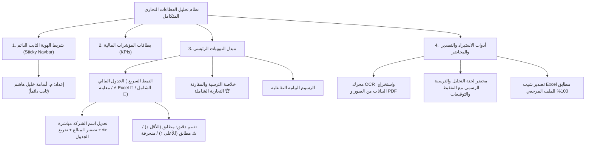

# محضر وخلاصة إنجاز نظام تحليل العطاءات التجاري المتكامل
**إعداد وتطوير: المهندس أسامة خليل هاشم**

---

### 📋 الملخص التنفيذي الشامل لما تم إنجازه:

تم بحمد الله وتوفيقه إنجاز وتطوير النظام المتكامل لتحليل وتقييم العطاءات والمناقصات والطلبيات لأي جهة حكومية أو خاصة، وفق أحدث الأسس الهندسية والرقابية لـ **تعليمات تنفيذ العقود الحكومية لعام 2025**.

---

### 1. الركائز القانونية والرقابية المدمجة في النظام:
* **قاعدة الاستبعاد الإجمالي ($\pm 20\%$):** استبعاد العطاءات المتجاوزة أو المنخفضة عن الكلفة التخمينية بنفس النسبة (المادة 13/ثالثاً/أ).
* **استثناء التوصية بالتفاوض:** إذا كان أقل عطاء مطابق للمواصفات يتجاوز الحد المسموح، توصي لجنة التحليل (لا تتفاوض بنفسها — ذلك اختصاص لجنة المراجعة) بإحالة الموضوع للتفاوض على تخفيض السعر ضمن الحدود المسموحة (المادة 13/ثالثاً/ب).
* **معيار الانحراف الجزئي واتزان العطاء:** قياس نسبة الفقرات المنحرفة وتطبيق الأسعار الموزونة كشرط تعاقدي لحماية أوامر التغيير (المادة 25/ثالثاً) — مؤشر استرشادي في الجدول المعتمد، لا يُستخدم كسبب استبعاد مستقل.
* **التدقيق والتصحيح الحسابي:** كشف أخطاء الضرب والجمع في أوراق المقاولين والاعتداد بسعر المفرد (ضابط رقابي داخلي؛ السند القانوني الدقيق لهذه القاعدة قيد التأكيد).
* **التفقيط والمطابقة النصية:** تفقيط المبالغ بالحروف العربية وتطبيق قاعدة تقديم المكتوب كتابةً على المكتوب رقماً عند الاختلاف.

---

### 2. واجهات ومكونات النظام الرئيسية:

---

### 3. مسارات الملفات والتشغيل المعتمدة:
* **الملف التنفيذي المستقل (أوفلاين 100% بدون إنترنت):** `نظام_تحليل_العطاءات.html`
* **مشغل النظام السريع:** `تشغيل_النظام.bat` — يفتح الملف أعلاه بنافذة تطبيق مستقلة (Edge/Chrome) بلا شريط المتصفح.
* **دليل النظام الفني والقانوني الشامل:** `HANDOFF.md`

### 4. التثبيت كتطبيق ويندوز (من الرابط):
**https://usama-kh75.github.io/tender-analysis-system/**

1. افتح الرابط في Edge أو Chrome.
2. من شريط العنوان اضغط أيقونة «تثبيت التطبيق» (أو من القائمة: التطبيقات ← تثبيت هذا الموقع كتطبيق).
3. يظهر النظام في قائمة ابدأ وشريط المهام بنافذته الخاصة، ويعمل بلا إنترنت بعد أول فتح.

* **البيانات على جهازك وحده:** لا يُرفع أي مشروع إلى الإنترنت. والتطبيق المثبَّت منفصل عن الملف المحمول — لنقل المشاريع بينهما استعمل تصدير/استيراد النسخة الاحتياطية (JSON).
* **مسح بيانات المتصفح يحذف المشاريع** — احتفظ بنسخة احتياطية دورية.
* **التحديثات:** تصل تلقائياً عند فتح التطبيق مع اتصال بالإنترنت، ولا تُنشر إلا بإصدار رقم جديد.
